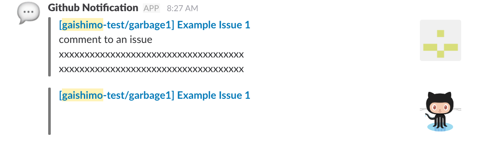

github-participating-notifications
====

This is a lambda tool :hammer: that sends github participating notifications to your slack channel 🔉.

## Description

Have you ever wanted to receive only github notifications that relate to you? This tool sends only your participating notifications to your slack channel. By using this, you can gather your related notifications from various projects into one channel and react to them immediately.

This code is assumed to run on AWS Lambda and you can easily deploy by Claudia.js.


## Slack message format

example:


## Setup

### Install and configure Claudia.js

You need an AWS Account (IAM Profile) and Claudia.js.
Please see [Installing and configuring Claudia.js](https://claudiajs.com/tutorials/installing.html).


### Prepare env.json

You need to set the Slack WebHook URL and github personal access token in env.json.
The access token should have scopes of 'repo' and 'notifications'.

```
cat <<-EOS > .env.json
{
  "GITHUB_TOKEN": "<your Github personal access token>",
  "SLACK_WEBHOOK_URL": "<your Slack WebHook url>"
}
EOS
```

### Create a DynamoDB table

This tool uses a DynamoDB table to save notifications to remember which notifications are already sent.

You can create it by [AWS CLI](https://github.com/aws/aws-cli) command.
```
aws dynamodb create-table \
  --table-name github_notifications \
  --attribute-definitions AttributeName=id,AttributeType=N AttributeName=at,AttributeType=S \
  --key-schema AttributeName=id,KeyType=HASH AttributeName=at,KeyType=RANGE \
  --provisioned-throughput ReadCapacityUnits=1,WriteCapacityUnits=1 \
  --query TableDescription.TableArn --output text
```

The table name is `github_notifications`.

### Deploy

Deploy lambda function.

The default region is ap-northeast-1. If you want to change, please change the `--region` option in `create` script in package.json.

```package.json
{
  ...
  "scripts": {
    "create": "npm test && npm run transpile && claudia create --name github-participating-notifications --handler bin/lambda.handler --region us-east-1 --set-env-from-json env.json --policies policies --timeout 10",
  },
  ...
```

Deploy (create)

```
npm install
npm run create
```

### Test

```bash
claudia test-lambda --event event.json
```


### Scheduling

You can run this lambda function regularly by following command.
Please change the interval by modifying `--schedule option`.

```
claudia add-scheduled-event \
  --name simple-lambda-scheduled-event \
  --event event.json \
  --schedule 'rate(5 minutes)'
```